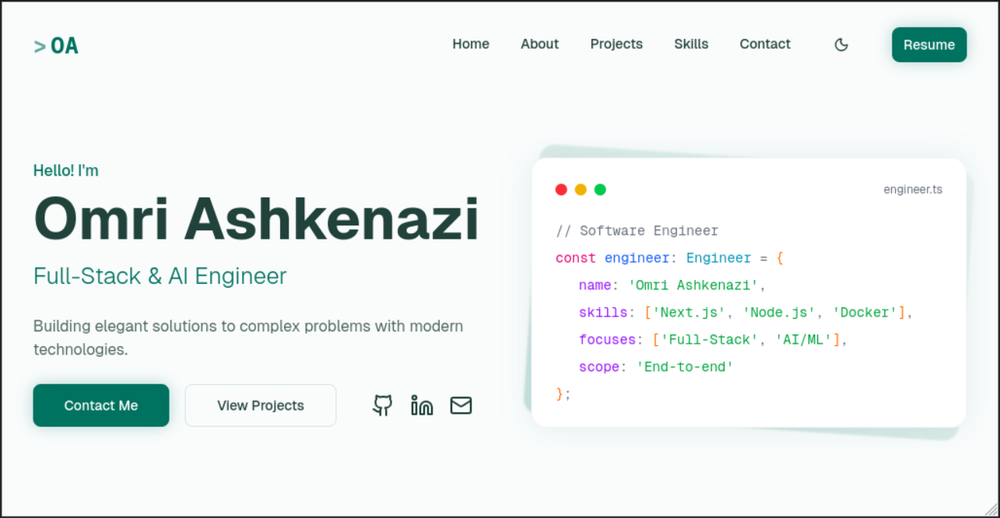

# Hello, I'm Omri

Source code for my personal portfolio website.

**Live site:** [ashkenazzio.github.io](https://ashkenazzio.github.io)

## About Me

Full-Stack & AI Engineer based in Tel Aviv. I build web applications end-to-end, from server configuration to deployment. Open-source advocate and homelab enthusiast.

Graduate of the AI & Deep Learning Development program by Google x Reichman Tech School.

## Built With

- **Next.js 15** & **React 19**
- **TypeScript**
- **Tailwind CSS 4** with custom color palette and dark mode
- **Framer Motion** for scroll animations and interactions
- **Radix UI / shadcn** for accessible components
- **React Hook Form + Zod** for form validation
- **Web3Forms** for contact form submissions

## Features

- **Hover card effects** with cursor-following glow
- **Touch-aware interactions** for mobile devices
- **Scroll-triggered animations** with staggered timing
- **Dark mode** support
- **Accessibility** considerations including reduced motion support

## Get in Touch

Open to conversations about web development, AI projects, or collaborations.

- **GitHub**: [@ashkenazzio](https://github.com/ashkenazzio)
- **LinkedIn**: [/in/ashkenazzio](https://linkedin.com/in/ashkenazzio)
- **Email**: ashkenazzio@gmail.com
